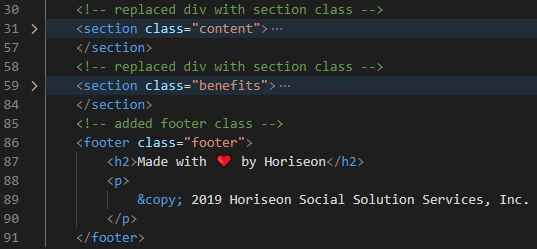
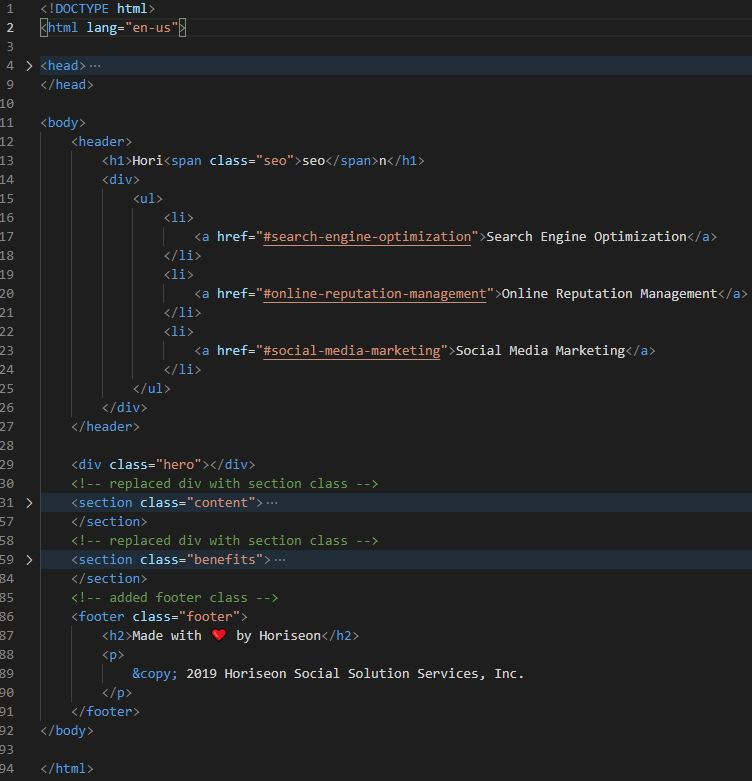
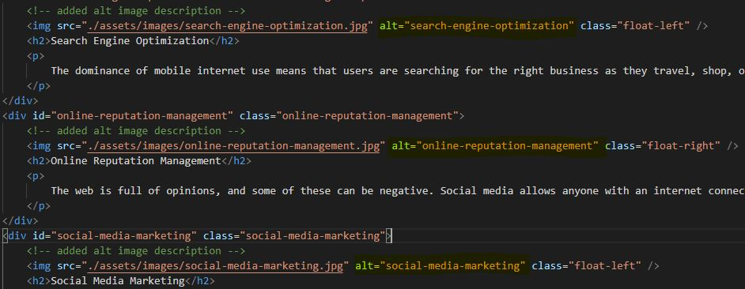
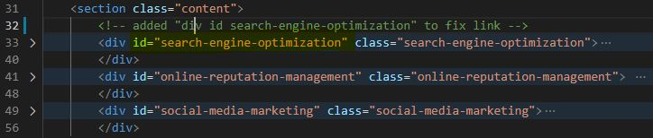
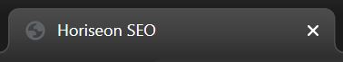

# Homework-3-27
# Refactoring Horiseon webpage

## This project was aimed at improving accessibility standards of this website in order to better optimize it for search engines. These are the steps taken to meet said standards.

Changes were made to several HTML elements in order to better follow correct HTML semantics

The elements follow a logical structure independent of styling and positioning 

Added alt attributes to image elements 

Added a div id to fix a link

Changed the title to be more descriptive and concise 

Confirmed that Heading attributes fall in sequential order

